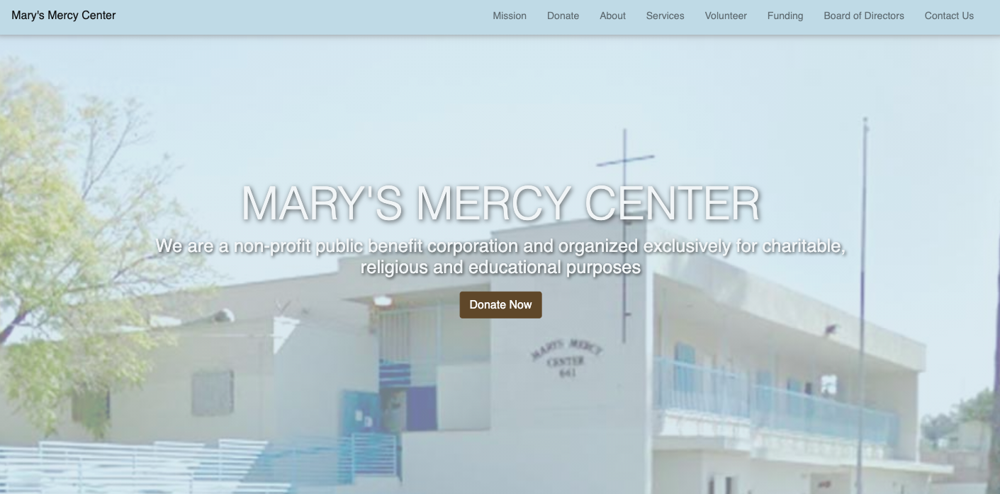
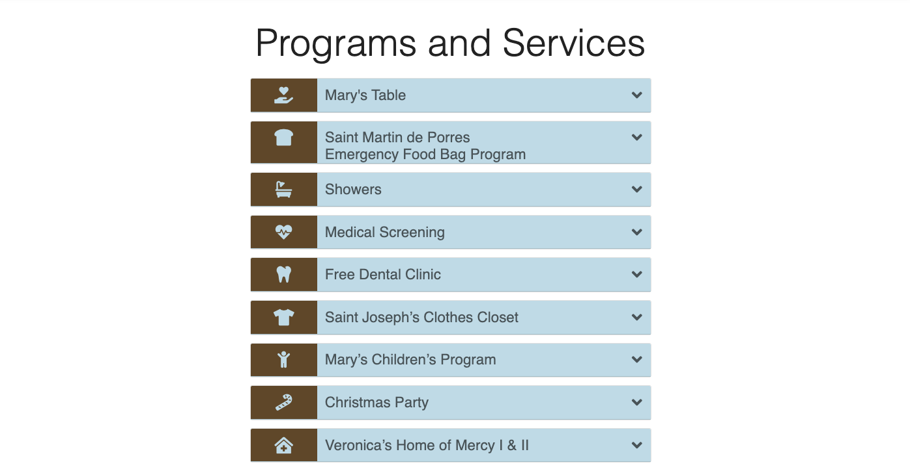
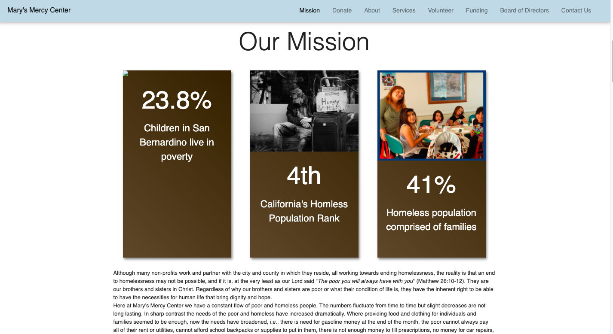
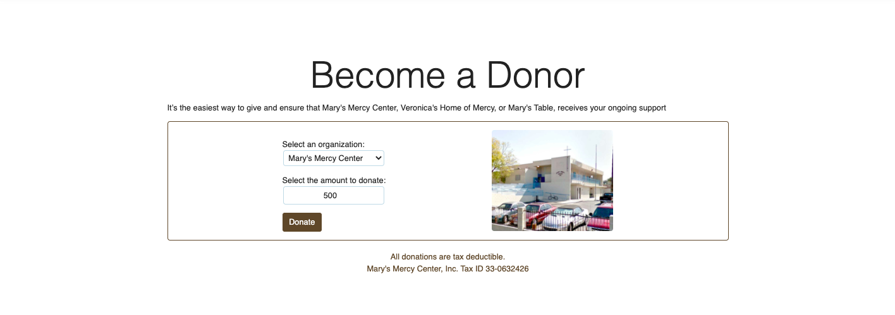

# marysMercyCenter

[Click here to visit the page](https://cookiebyte4130.github.io/marysMercyCenter/)

## Description

This is an informational site.

Users can scroll through the site to learn about the services provided and the mission of the organization.

Users will be able to donate to Mary's Mercy Center and related programs via the site's links to paypal. Users will also be able to contact the organization easily through the contatct section.

## Support

If you have any questions or comments regarding this site please email me at amaliacbryant@gmail.com

## Contributing

This project is currently closed to external contributions.

## Authors and acknowledgment

Code architect and writer: Amalia Bryant

## License

[MIT 2021 Amalia Bryant](https://choosealicense.com/licenses/mit/)

## Project status

Still under construction
Coming soon: section with most recent Facebook Posts
